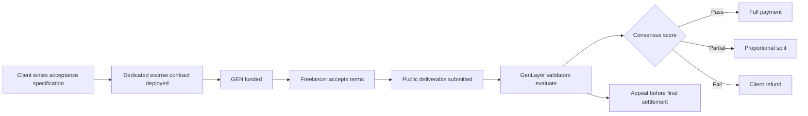
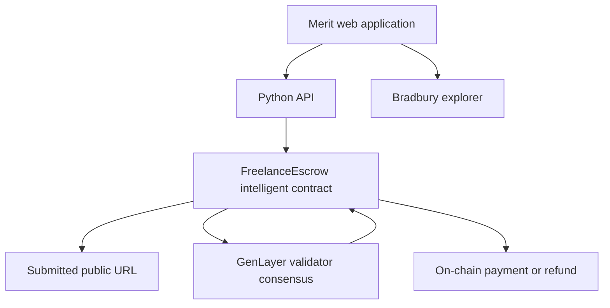

# Merit

**AI-arbitrated freelance escrow on GenLayer.**

Merit turns a plain-English acceptance specification into enforceable payment rules. A client posts and funds work, a freelancer accepts the terms and submits a public deliverable, and GenLayer validators evaluate that work before the intelligent contract releases, splits, or refunds the escrow.

[Live application](https://lexiweb31.github.io/genlayer-escrow/) · [Bradbury explorer](https://explorer-bradbury.genlayer.com) · [Demo script](DEMO_SCRIPT.md)

## Why this needs GenLayer

Traditional smart contracts can verify deterministic facts such as signatures and transfers. They cannot read a website and decide whether it satisfies a natural-language agreement.

Merit uses GenLayer to:

- retrieve a submitted public deliverable;
- isolate fetched content as untrusted evidence;
- evaluate it against immutable acceptance terms;
- reach validator consensus on a score and rationale;
- settle escrow according to pre-agreed thresholds;
- preserve an inspectable appeal and settlement trail.

## Settlement model

| Validator score | Outcome |
|---|---|
| Score ≥ full-payment threshold | Full payment to freelancer |
| Partial floor ≤ score < full-payment threshold | Proportional payment and client refund |
| Score < partial floor | Full refund to client |

The client, freelancer, and platform cannot silently change these rules after deployment.

## Product journey



## Architecture



### Core components

- `contracts/freelance_escrow.py` — job lifecycle, funding, evaluation, appeal, and settlement.
- `contracts/evaluate_submission.py` — standalone intelligent evaluation contract.
- `dashboard/api.py` — registry and transaction API used by the web interface.
- `docs/index.html` — GitHub Pages frontend.
- `public/index.html` — mirrored static frontend for alternative hosting.
- `tests/` — direct and integration contract tests.

## Competition-ready UX

- Judge Mode with a guided three-minute route.
- Light and dark themes.
- Resilient, clearly labeled fallback when testnet services are slow.
- Interactive payout simulator.
- Live agreement-quality analysis before deployment.
- SHA-256 agreement fingerprint preview.
- Validator reasoning and decision evidence room.
- Printable settlement evidence report.
- Persistent transaction progress tracking.
- Search, sorting, saved jobs, deep links, and keyboard command center.
- Responsive mobile layout and reduced-motion support.

## Security and trust model

- **Non-custodial:** each job uses a dedicated escrow contract.
- **Prompt-injection boundary:** fetched deliverables are treated as untrusted data, not evaluator instructions.
- **Consensus:** no single model response controls payment.
- **Immutable settlement rules:** score thresholds are fixed before work begins.
- **Inspectable outcomes:** contract addresses, rationale, score, and settlement are surfaced in the application.
- **Honest fallback:** demo state is visibly labeled and cannot submit simulated chain actions.

## Run locally

The frontend is static and expects the deployed API configured in `API_BASE`.

```bash
python3 -m http.server 8080 --directory docs
```

Open `http://localhost:8080`.

For API and contract requirements, install the dependencies from `requirements.txt` and configure the Bradbury deployment addresses in `artifacts/deployments.json`.

## Verification

```bash
python3 -m pytest tests/direct -q
python3 -m pytest tests/integration -q
```

The frontend's inline JavaScript can be extracted and checked with Node.js as part of release validation. Keep `docs/index.html` and `public/index.html` synchronized before publishing.

## Demo safety

If the live API does not respond quickly, select **Enter resilient demo**. The fallback preserves the complete presentation journey while labeling sample state and disabling all actions that would otherwise submit a transaction.

## License

Built as an open competition prototype for GenLayer's Bradbury testnet.
